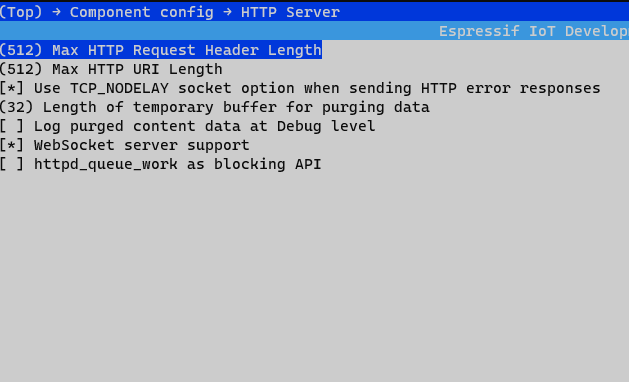
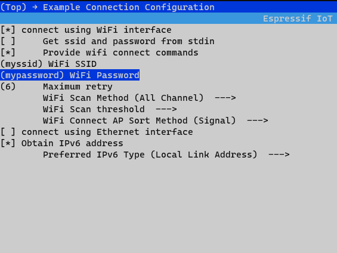

# Introduction

PID controllers are widely used in robotics and process automation. Often designers recompile the executable many times when tuning the controller. This component provides a window into the controller to tune it in real time, avoiding hardcoding the values and therefore multiple recompilations of the source files. 

# Target Framework and Device
ESP-IDF and ESP32 family of microcontrollers (written entirely in C and  easily adaptable to work on other platforms)

# Tuning Strategies Supported
## Local Tuning
- You need to build a simple circuit as shown in the diagram below.

- You may set the pins as you wish in the Kconfig file at the root of the component. 

- When the tactile is pressed, an interrupt fires and the ISR samples the ADCs which the POTs are connected to. These values are assigned to P, I, D global variables and written to NVS to persist between power cycles. 

## Network Tuning. 
- You need to setup a simple app (such as the one provided alongside). 
- When the components is configured to enable this mode, it opens a WebSocket server on port 80. You need to send the PID values in the form "P I D" over this connection to the server. The values are modified and written to NVS. 

# Setup 
Include the component in your project. 
The following boilerplate must be present in your application code to configure the interfaces properly. 
```
    ESP_ERROR_CHECK(nvs_flash_init());
    ESP_ERROR_CHECK(esp_netif_init());
    ESP_ERROR_CHECK(esp_event_loop_create_default());
```
 - To load previous PID values, before starting any type of tuning, load the values from NVS:
 ```
     load_pid_values();
 ```
## If using Local Tuning
- In your application code, call:
```
    start_local_pid_tuner();
```
- Build your circut and modify the Kconfig if need be (i.e if using different pins)

## If using Network Tuning
- In your application code, call, 
```
    start_socket_pid_tuner();
```
- Enable WebSocket over HTTP in menuconfig, 
```
menuconfig -> Component Config -> HTTP Server -> Websocket Server Support
```


- Set connection parameters 
```
menuconfig -> Example Configuration
```

 

# Running

- If using network tuning, when the application starts up, the IP of the server is printed on the serial console. Feed this to your frontend application and send the appropirate string format ("P_value I_value D_value")

- If using the provided basic webapp, set the following line accordingly in `script.js` :
```
ws = new WebSocket("ws://172.22.202.69:80/ws");
``` 

# Notes
- The two tuning methods can be used independently or at the same time without conflicts.
- The ADC attenuation is set to ADC_ATTEN_DB_12 limiting the measurable input range to 150 mV ~ 2450 mV. Plan accordingly when setting up the POTs.